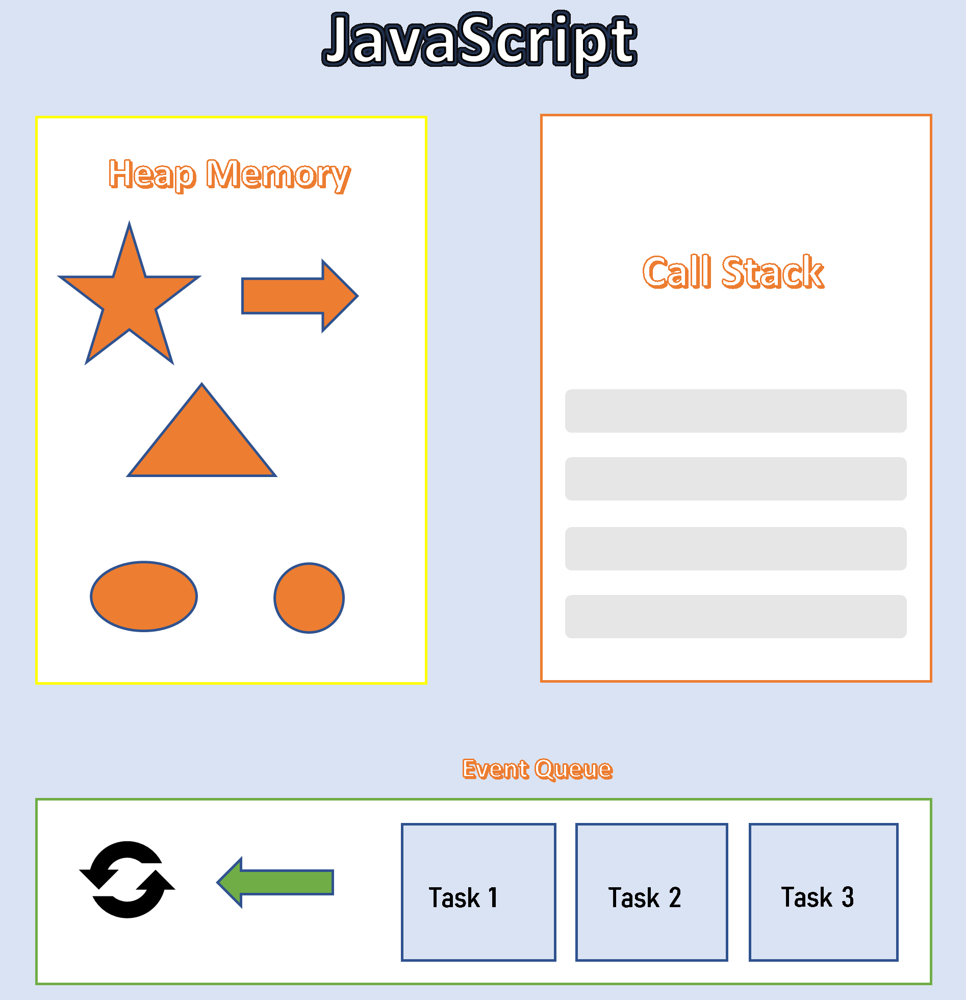

# What is JavaScript? {#chapter1 .chapter}

JavaScript (JS) is a lightweight interpreted or JIT-compiled programming language with first-class functions. While it is most well-known as the scripting language for Web pages, many non-browser environments also use it, such as Node.js, Apache CouchDB and Adobe Acrobat. JavaScript is a prototype-based, multi-paradigm, dynamic language, supporting object-oriented, imperative, and declarative (e.g. functional programming) styles [1].

JavaScript is case-sensitive and uses the Unicode character set. Variables can be defined with *umlaut(ä, ö and ü)*.

JavaScript functions are first-class objects. They can be stored in a variable, passed to a function as a parameter and returned from a function. Interestingly a new property can also be defined as can be done on a normal object.

JavaScript conforms to ECMAScript specification.

JS runs in a single threaded environment. Call stack, heap memory and event queue are mainly 3 parts of JS engine. Event queue helps in writing a non-blocking asynchronous code.

{width=100%}

