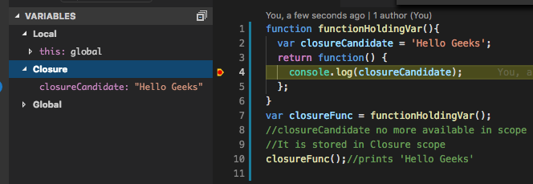

# What is closure?

When a function is created using a variable in its outer function scope, the variable is stored as closure.

```js
function functionHoldingVar(){
  var closureCandidate = 'Hello Geeks';
  return function() {
    console.log(closureCandidate);
  };
}
var closureFunc = functionHoldingVar();
//closureCandidate no more available in scope
//It is stored in Closure scope
closureFunc();//prints 'Hello Geeks'
```
Please see below a snapshot of variables when a breakpoint is placed.



The value of variable in closure does not depend on when the function is created rather when the function is executed. Below example would explain this.
```js
var globalObj = {};
function returnFunctionWithClosure() {
  //store globalObj in local var
  var localRef = globalObj;
  localRef.test = 'Function Scope';
  return function() {
    //localRef is stored in closure
    console.log(localRef.test);
  };
}
var closureWithGlobalRef 
        = returnFunctionWithClosure();
//Changing the value in global scope
globalObj.test = 'Gobal Scope';
//As globalObj and localRef points to same object
closureWithGlobalRef(); //prints 'Gobal Scope'
```
That is all about closure.